# Architecture

## The idea in one line

Listen where people describe problems, keep only the ones that sound like someone would pay, and surface **the same problem said by different people**, because one post is noise and ten people saying it is a business.

## Pipeline

```mermaid
flowchart LR
  subgraph Sources
    HN[Hacker News<br/>Algolia API]
    GH[GitHub<br/>Search API]
    SE[Stack Exchange<br/>API]
    AS[App Store<br/>review RSS]
    FT[UK Find a Tender<br/>OCDS API]
    BS[Bluesky<br/>searchPosts]
    RD[Reddit RSS<br/>off by default]
  end
  Sources --> N[Normalise to Signal]
  N --> D[Dedupe<br/>data/seen.json]
  D --> S[Heuristic score 0–100]
  S --> C{Claude review<br/>top 40 demand}
  C --> ST[(data/signals/<br/>YYYY-MM-DD.json)]
  ST --> CL[Cluster last 30 days<br/>= repeated pain]
  CL --> DG[Digest<br/>data/digests/*.md]
  DG --> P[Push: Telegram /<br/>Discord / ntfy]
```



Everything runs in one GitHub Actions job (about 1–3 minutes). The job commits `data/` back to the repo. That's the database, the history you can browse on GitHub, and the activity that stops GitHub from auto-disabling the schedule after 60 idle days.

## Code map

| Path | What it does |
|---|---|
| `config/radar.config.ts` | **The file you tune.** Phrases, sources, niches, thresholds. |
| `src/index.ts` | CLI: `run`, `--dry-run`, `--fixtures`, `--sources`, `test-notify` |
| `src/run.ts` | The pipeline above, start to finish. Each source is isolated: one failing just shows ⚠️ in the run report. |
| `src/collectors/*.ts` | One file per source. Each turns its API's response into the common `Signal` shape. |
| `src/pipeline/score.ts` | Free first-pass score: pain phrases, money words, explicit "I'd pay", engagement, niche match, bounty/tender value. |
| `src/pipeline/classify.ts` | Claude reads the top candidates and scores them with a fixed rubric (below). |
| `src/pipeline/cluster.ts` | Repeated-pain detection: TF-IDF + cosine similarity, "join the nearest group or start a new one". |
| `src/digest/render.ts` | The Markdown digest and the short phone version. |
| `src/notify/index.ts` | Telegram, Discord, ntfy. |
| `src/store/jsonStore.ts` | JSON files in `data/`. |
| `src/fixtures.ts` + `test/fixtures/` | Offline sample responses so the demo and tests need no internet or keys. |

### The `Signal` shape

Every source becomes this (see `src/types.ts`):

```ts
{ id, source, kind: 'demand' | 'bounty' | 'tender' | 'launch' | 'tool',
  title, body, url, author /* hashed */, createdAt,
  engagement: { score, comments, stars, views }, money?, tags,
  painScore, matchedPhrases, ai? }
```

Adding a source means writing one collector that returns `Signal[]` and listing it in `src/collectors/index.ts`.

## Scoring

**Stage 1: heuristic (free, runs on everything).** Demand posts start at 25 if they contain a pain phrase (30 for sources where every post is a request, like Software Recommendations or a 1–2★ review), then gain points for more phrases, money words (+10), explicit willingness to pay (+15), engagement (up to +15) and matching one of your niches (+10). Bounties and tenders score on their cash value. Anything with an excluded phrase (promo codes, hiring posts) scores 0.

**Stage 2: Claude (optional, top 40 demand posts a day).** Claude scores each post with a fixed rubric so days are comparable:

| Part | Points |
|---|---|
| Pain intensity (mild wish → costly, recurring, urgent) | 0–25 |
| Willingness to pay (none → implied → explicit) | 0–25 |
| Specific workflow (vague → concrete steps/tools/volumes) | 0–15 |
| Author is a business or professional | 0–15 |
| Names an existing product they're unhappy with (proves a market) | 0–10 |

It also writes a one-line problem statement, who has it, a niche label and a product idea. The final score is 70% Claude, 30% heuristic. Posts Claude marks as not real pain (ads, jokes, rants) drop to 30% of their score.

**Cost:** about 700 input and 120 output tokens per post. At 40 posts/day on Claude Haiku 4.5 ($1 / $5 per million tokens) that's about **$0.05/day, roughly $1.50/month**. Moving to the Message Batches API halves it (see roadmap).

## Repeated pain (clustering)

Demand signals from the last 30 days are grouped by text similarity. When Claude has reviewed a post, the grouping uses Claude's one-line problem statement instead of the raw post, which works much better because "chasing late invoices", "overdue invoice reminders" and "clients never pay on time" become similar sentences. A group counts as a pattern when it has **3+ posts from 2+ different people**, and it's shown if it was active in the last 7 days.

This is deliberately simple (no ML dependency). The upgrade path is embeddings once there are a few weeks of data (see roadmap).

## Design decisions

| Decision | Why |
|---|---|
| **GitHub Actions + JSON files in the repo** instead of a server + database | Free, nothing to host, every day's results browsable on GitHub, and the daily commit prevents GitHub's 60-day schedule shutdown. Swap for Supabase when there's a web app. |
| **Zero runtime dependencies**, TypeScript run directly by Node 22 | No `npm install` in the daily job, nothing to break or patch, starts in under a second. |
| **Telegram as the main channel** | Free and reliable from GitHub's servers. Free ntfy.sh limits by IP address and GitHub runners share IPs. Telegram also supports 👍/👎 buttons for the feedback loop on the roadmap. |
| **Claude is optional and only sees the top 40** | The radar is useful with no key at all. The heuristic pre-filter keeps the AI cost to pennies. |
| **Usernames hashed before storage** | Enough to count distinct people; no personal data piling up in a repo (UK GDPR data minimisation). |
| **Every source isolated** | Platforms change access rules often (see Reddit). One broken source shows a ⚠️ line; the digest still arrives. |
| **Reddit off by default** | Its API needs approval now and the public JSON is gone. RSS still works but isn't an approved route. See [SOURCES.md](SOURCES.md#reddit). |

## Limits to know

- **Nothing has been run against the live APIs yet.** The build environment had no internet access to these sites, so every collector is written from each API's documentation and tested against sample responses. The first real run (step 3 of the README) is the real test; the run report at the bottom of each digest shows which sources worked.
- GitHub's scheduled runs can start 5–30 minutes late.
- The App Store feed has been reported to sometimes return an empty result. The log notes any app with zero entries.
- Hacker News search is run once per pain phrase (~37 requests per run), well within Algolia's 10,000/hour.
